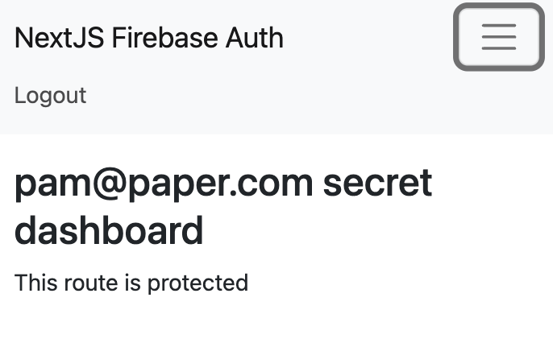

# Next.js Firebase Auth

This is a simple Next.js app that uses Firebase Authentication to sign in users. It uses the Firebase Admin SDK to verify the ID token sent from the client.

## Live Demo

- [https://nextjs-firebase-auth-green.vercel.app/](https://nextjs-firebase-auth-green.vercel.app/)

#### Screenshot



## Getting Started

- Clone the repo and `cd` into it

- Create a Firebase project on the [Firebase console](https://console.firebase.google.com/)

- Replace the Firebase config in `firebase/config.ts` with your own. (You can find this in the Firebase console)

> Note: Remember to enable email/password sign-in in the Firebase console

- Install the dependencies:

```bash
npm install
```

- Run the development server:

```bash
npm run dev
```

- Open [http://localhost:3000](http://localhost:3000) with your browser to see the result

- Sign in with an email and password

## License

- [MIT](LICENSE.md)
